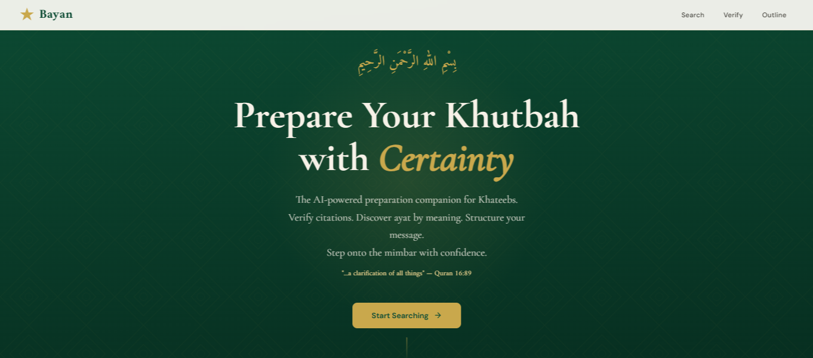
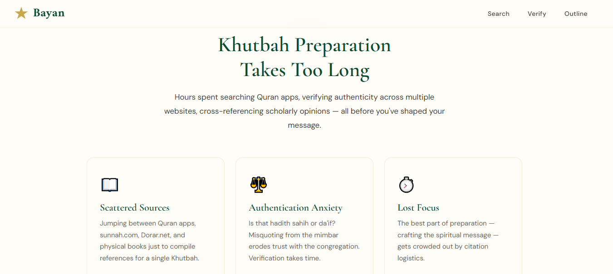
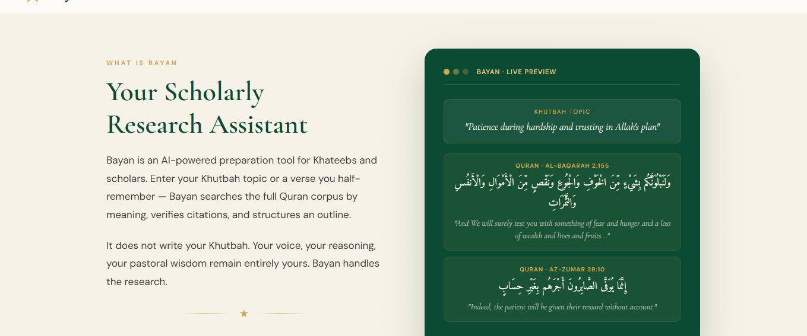
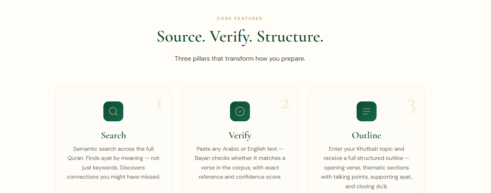
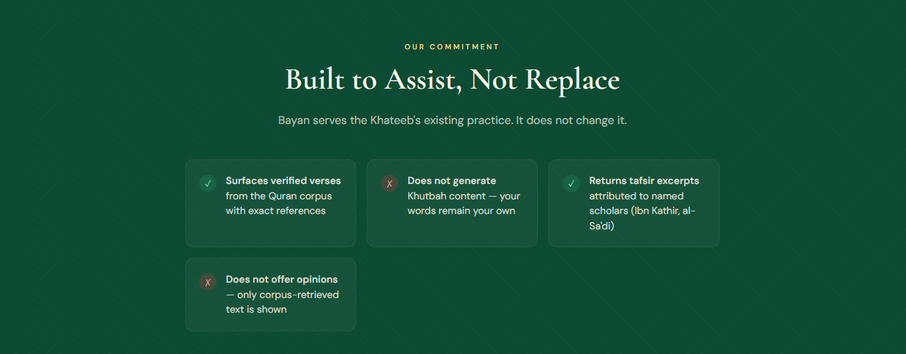
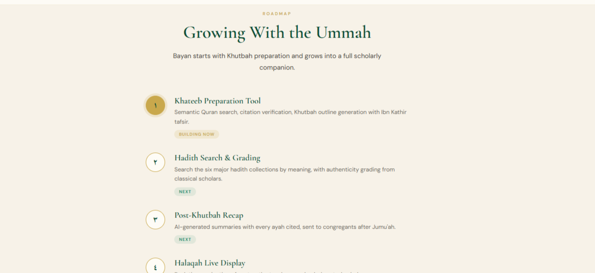
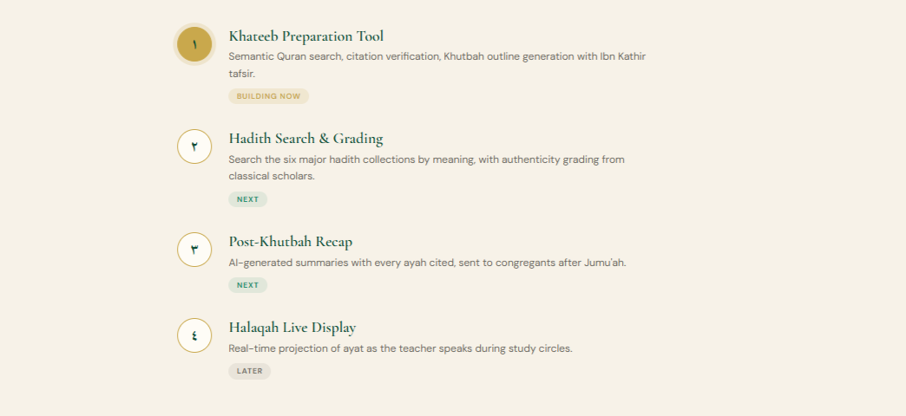

# بيان — Bayan

> **The Khateeb's Preparation Companion**
> Verify citations. Discover ayat by meaning. Structure your Khutbah.

## Screenshots



<table>
  <tr>
    <td></td>
    <td></td>
  </tr>
  <tr>
    <td></td>
    <td></td>
  </tr>
  <tr>
    <td></td>
    <td></td>
  </tr>
</table>

## What is Bayan

Bayan is an AI-powered preparation tool for Khateebs and scholars. Enter your Khutbah topic or a verse you half-remember — Bayan searches the full Quran corpus by meaning, verifies citations, and structures an outline.

It does not write your Khutbah. Your voice, your reasoning, your pastoral wisdom remain entirely yours. Bayan handles the research.

## Core Features

| Feature | Description |
|---|---|
| **Search** | Semantic search across the full Quran. Finds ayat by meaning — not just keywords. |
| **Verify** | Paste any Arabic or English text — Bayan checks whether it matches a verse, with exact reference and confidence score. |
| **Outline** | Enter a topic and receive a full structured Khutbah outline — opening verse, sections with talking points, supporting ayat, and closing du'ā. |

## Our Commitment

Bayan surfaces verified sources from the corpus. It does not generate Khutbah content — your words remain your own.

## Roadmap

| Phase | Feature | Status |
|---|---|---|
| ١ | Khateeb Preparation Tool — semantic Quran search, citation verification, outline generation | **Building Now** |
| ٢ | Hadith Search & Grading — six major collections with authenticity grading | Next |
| ٣ | Post-Khutbah Recap — summaries sent to congregants after Jumu'ah | Next |
| ٤ | Halaqah Live Display — real-time ayah projection during study circles | Later |

## Architecture

```
Bayan/
├── backend/               # FastAPI + asyncpg
│   ├── app/
│   │   ├── api/           # POST /search  /verify  /outline
│   │   ├── services/      # Claude RAG, embedding, search, verify, outline
│   │   └── db/            # asyncpg pool + hybrid search queries
│   └── ingestion/         # One-time data pipeline (10 scripts)
├── frontend/              # React + Vite
│   └── src/
│       ├── views/         # Home, Search, Verify, Outline
│       └── components/    # Nav, VerseCard, Ornament
└── quran-data/            # Corpus (read-only)
```

**Stack:** PostgreSQL + pgvector · OpenAI `text-embedding-3-large` · Claude (Anthropic) · FastAPI · React

**Design principle:** Claude is the orchestration layer only — never a citation source. Every verse is retrieved from the ingested corpus via tool use and validated before returning to the user.

## Running Locally

### Backend

```bash
cp .env.example .env
# fill in POSTGRES_PASSWORD, OPENAI_API_KEY, ANTHROPIC_API_KEY

docker compose up db
cd backend && alembic upgrade head
docker compose --profile ingestion up ingestion   # one-time data load
uvicorn app.main:app --reload
```

### Frontend

```bash
cd frontend
bun install
bun run dev
# → http://localhost:5173
```

## Data Sources & Credits

The Quran corpus powering Bayan — Arabic text, translations, tafsir, topics, themes, verse similarities, and mutashabihat — is sourced from **[Qul](https://qul.tarteel.ai/)** by Tarteel AI, an open-source Islamic data library.

> Qul provides structured, machine-readable Quranic data for developers building Islamic applications. جزاهم الله خيراً.

*"...a clarification of all things" — Quran 16:89*
